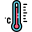
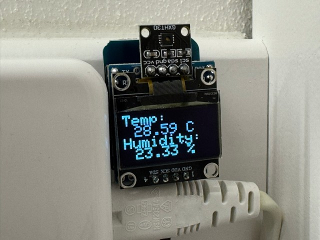

#  Temperature Display

Uses an Wemos D1 mini with a GXHT30 I²C temperature & humidity sensor and a SSD1306 I²C 0.96" OLED display.

This project supports OTA updates, uses the WiFi manager to configure the WiFi and provides a `/read` endpoint to get the temperature and humidity as JSON and a `/reset` endpoint (`PUT`) to reset the module. The readings (and display) are updated every 2 seconds.



## Hardware

You'll need:

* Wemos D1 mini
* GXHT30 I²C temperature & humidity sensor
* SSD1306 I²C 0.96" OLED display

All of these components are readily available at the time of writing, you should be able to easily source them.

### PCB

The [`pcb`](/pcb/) directory contains the KiCad (9.0) design files for the Wemos D1 mini shield PCB. [PCBWay](https://www.pcbway.com/) reached out to me and was kind enough to support this project. When the PCB's have been received I will post photo's here and a link to the [PCBWay shared projects page](https://member.pcbway.com/specials/SharedProject) once it's done for easy ordering.

### DIY

Connect the GXHT30 and SSD1306 to the Wemos D1 mini's `3v3` pin, connect the grounds of all three modules. And connect `SDA` to `D2` (`GPIO4`) and `SCL` to `D1` (`GPIO5`). That's it. Done. Apparently some modules require 5V; if your display is glitching or not turning on, try connecting it to the 5V pin on the Wemos D1 mini. I power the project via the Wemos' onboard USB port but you should also be able to power it by directly powering the power pins.

```
                           +----------+        +------------------+
                           |  GXHT30  |        |     SSD1306      |
                           |    [X]   |        |                  |
                           |          |        |                  |
                           | V G  S S |        |    V  G  S  S    |
   +-----------------+     | C N  D C |        |    C  N  D  C    |
   |  Wemos D1 Mini  |     | C D  A L |        |    C  D  A  L    |
   |    (ESP8266)    |     +----------+        +------------------+
   |                 |       | |  | |               |   | |  |
   |              D1 |-------|-|--|-+---------------|---|-|--+
   |              D2 |-------|-|--+-----------------|---|-+
   |                 |       | |                    |   |
   |                 |       | |                    |   |
   |                 |       | |                    |   |
   |                 |       | |                    |   |
   |             GND |-------|-+--------------------|---+
+--| 3V3             |       |                      |
|  +-----------------+       |                      |
+----------------------------+----------------------+
```

## Attribution

* PCB design based based on [Jérôme Labidurie](https://github.com/jerome-labidurie)'s [Wemos D1 mini Shield template for KiCad](https://github.com/jerome-labidurie/d1_mini_kicad)
* [Logo by Freepik](https://www.freepik.com/icon/thermometer_8052191)