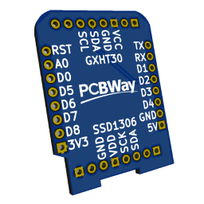

#  Temperature Display

Uses an Wemos D1 mini with a GXHT30 I²C temperature & humidity sensor and a SSD1306 I²C 0.96" OLED display.

This project supports OTA updates, uses the WiFi manager to configure the WiFi and provides a REST API to get the temperature and humidity as JSON. The readings (and display) are updated every 2 seconds and also output to serial.


## Hardware

You'll need:

* [Wemos D1 mini or clone](https://aliexpress.com/w/wholesale-wemos-d1-mini.html)
* [GXHT30 I²C temperature & humidity sensor module](https://aliexpress.com/w/wholesale-GXHT30-module.html)
* [SSD1306 I²C 0.96" OLED display](https://aliexpress.com/w/wholesale-SSD1306-0.96%22.html)
* 2x [2.54mm female header 8 pins](https://aliexpress.com/w/wholesale-2.54mm-female-header-8-pins.html)
* 2x 8 pin and 2x 4 pin [2.54mm pin headers](https://aliexpress.com/w/wholesale-single-row-male-2.54mm.html)

All of these components are readily available at the time of writing, you should be able to easily source them.

### PCB

The [`pcb`](/pcb/) directory contains the KiCad (9.0) design files for the Wemos D1 mini shield PCB. [PCBWay](https://www.pcbway.com/) reached out to me and was kind enough to support this project. The project is available at [PCBWay's Shared Projects](https://www.pcbway.com/project/shareproject/Temperature_display_f0e459fd.html) for easy ordering.

  [](https://www.pcbway.com/) 

[](/img/PCBWay/7.jpg)  [](/img/PCBWay/6.jpg) [](/img/PCBWay/8.jpg)

For more pictures of the PCB and/or project see [the project page](https://www.pcbway.com/project/shareproject/Temperature_display_f0e459fd.html) or the [/img/PCBWay](/img/PCBWay/) directory. I would like to thank PCBWay again 🙏 Shipping was incredibly quick 🛫🛬 and the PCB is perfectly finished 👌

In a next iteration I'm hoping to integrate the GXHT30 on the shield, but being pretty new to PCB design this first iteration uses a module.

### DIY

Connect the GXHT30 and SSD1306 to the Wemos D1 mini's `3v3` pin, connect the grounds of all three modules. And connect `SDA` to `D2` (`GPIO4`) and `SCL` to `D1` (`GPIO5`). That's it. Done. Apparently some modules require 5V; if your display is glitching or not turning on, try connecting it to the 5V pin on the Wemos D1 mini. I power the project via the Wemos' onboard USB port but you should also be able to power it by directly powering the power pins.

```
                           +----------+        +------------------+
                           |  GXHT30  |        |     SSD1306      |
                           |    [X]   |        |                  |
                           |          |        |                  |
                           | V G  S S |        |    V  G  S  S    |
   +-----------------+     | C N  D C |        |    C  N  D  C    |
   |  Wemos D1 mini  |     | C D  A L |        |    C  D  A  K    |
   |    (ESP8266)    |     +----------+        +------------------+
   |                 |       | |  | |               |  |  |  |
   |              D1 |-------|-|--|-+---------------|--|--|--+
   |              D2 |-------|-|--+-----------------|--|--+
   |                 |       | |                    |  |
   |                 |       | |                    |  |
   |                 |       | |                    |  |
   |                 |       | |                    |  |
   |             GND |-------|-+--------------------|--+
+--| 3V3             |       |                      |
|  +-----------------+       |                      |
+----------------------------+----------------------+
```

## Software

This is a PlatformIO project. I'm sure someone will help convert this to an Arduino IDE project, but it's not going to be me.

### How to get started

1. Open this folder in [PlatformIO for VSCode](https://platformio.org/platformio-ide)
2. Copy [`include/example_config.h`](include/example_config.h) to `include/config.h` and adjust the **devicename** and OTA update password
3. Copy [`example_env_secrets.ini`](example_env_secrets.ini) to `env_secrets.ini` and set the same password for the `--auth` option
4. ⚠️ Make sure your [`platformio.ini`](platformio.ini) file has `default_envs` set to `d1_mini_serial`
5. Connect your USB cable to your device and the Wemos D1 mini
6. Compile the project and upload via (USB virtual) serial to your Wemos D1 mini
7. You should now be able to connect to a WiFi AP named after your **devicename** (see step 2); connect to it, set your WiFi credentials and save
8. The Wemos D1 mini should reboot and the OLED display should (shortly) show the IP; the display should show any other errors or problems as well
9. Next time you update you can use the OTA configuration (`default_envs` set to `d1_mini_ota` and the correct IP in `env_secrets.ini` at the `upload_port` entry), no more need for USB cables

### Once it's up and running

The display will show the temperature in °C or Fahrenheit (see `include/config.h`) and the humidity in %RH (Relative Humidity). If your sensor is way off you can fix this by setting `TEMPERATUREOFFSET` and/or `HUMIDITYOFFSET` in `include/config.h` and updating the device. The temperature and humidity will also be output to the serial port every time the sensor is read (see `UPDATEINTERVAL`) and when you use the `/read` endpoint of the REST API (e.g. `http://<deviceip>/read` [`GET`]) you'll get the readings as json:

```json
{
  "celsius": {
    "temperature": 22.81,
    "offset": -5
  },
  "fahrenheit": {
    "temperature": 73.058,
    "offset": -9
  },
  "humidity": {
    "relative_perc": 31.29,
    "relative_perc_offset": 8
  },
  "wifi": {
    "rssi": -48
  },
  "lastupdate": "1.62 seconds ago"
}
```

These values are also only update every time the sensor is read (again: see `UPDATEINTERVAL`). There is also a `/reset` endpoint ([`PUT`]) that will reboot the device.

## Attribution

* PCB design based based on [Jérôme Labidurie](https://github.com/jerome-labidurie)'s [Wemos D1 mini Shield template for KiCad](https://github.com/jerome-labidurie/d1_mini_kicad)
* [Logo by Freepik](https://www.freepik.com/icon/thermometer_8052191)